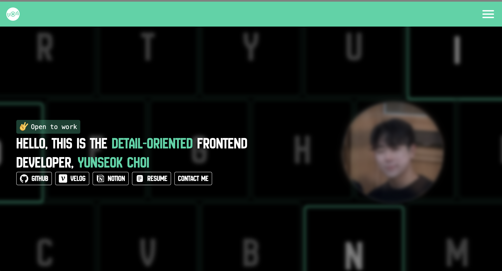

# My Portfolio v 2.0

저의 두번째 포트폴리오 웹사이트입니다.

> 링크 : https://yunseokchoi.vercel.app/

## ⚙️ Tech Stack

- Framework : Next.js
- Language : TypeScript
- Style : Emotion
- State Management : Recoil
- CI/CD : Github Actions

## 🙇 Introduce

### 소개 :

- 첫번째 섹션에는 저의 짧은 소개와 제 블로그들 및 이력서를 넣었습니다.
- 두번째 섹션에는 저의 기술스택들을 나열했습니다.
- 세번째 섹션에는 저의 목표를 적었습니다.
- 네번째 섹션에는 제가 만든 프로젝트들을 나열했습니다.
- 메뉴에는 언어(한국어, 영어) 토글 및 제 소셜 링크 버튼을 나열했습니다.

### 특징 :

- 이미지에 sharp라이브러리 사용 및 lazy loading을 통하여 응답속도를 4배 이상 빠르게 만들었습니다.
- 쿠키를 이용해 언어를 바꾸고 새로고침을 해도 해당 선택 언어가 유지되게 만들었습니다.
- 반응형으로 제작해 width가 바뀌어도 깨지지 않도록 구현하였습니다.
- UX를 위해 현재 스크롤 진행 바를 상단에 배치하고, 끝까지 다 내려갔을 때 한번에 위로 올라가기 위해 올라가기 버튼을 하단에 배치하였습니다.
